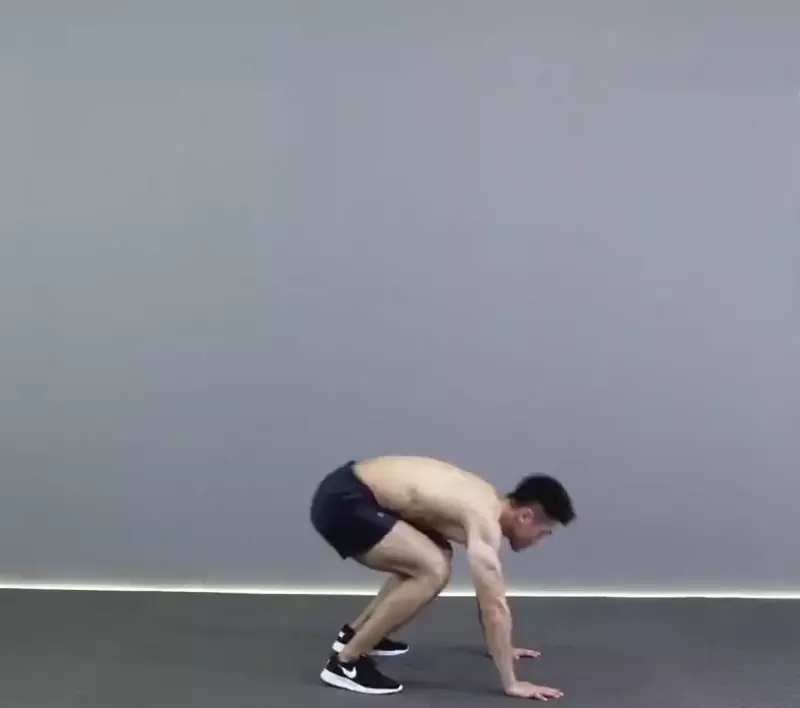
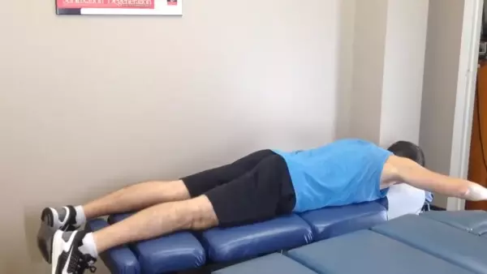

# Snatch Lifespan Plan

[中文](zh_CN.md)

# Healthy eyes
1. Use a high-resolution computer
  - HUAWEI MateBook X Pro, 13.9-inch, 3000×2000 (3K)
  - Macbook Pro, 16-inch, 3072×1920 (3K)
  - iMac Pro, 24-inch, 5120×2880 (5K)
  - iMac, 27-inch, 4096×2304 (4K)
2. Take regular breaks

## Burpee Jump

- [The Burpee... How To Perform With Correct Form](https://www.youtube.com/watch?v=peBeLWugiFc)
- [How To Do Burpees and Avoid Common Injuries](https://www.youtube.com/watch?v=tJrdJBWBu08)
- [Burpee + Tuck Jump - TheDailyHiit](https://www.youtube.com/watch?v=pMUGO2h2j0c)

## Superman Exercise

- [How To Do A Superman Back Exercise](https://www.youtube.com/watch?v=jb8wFomE1ic)
- [Superman Exercise for Spine Health](https://www.youtube.com/watch?v=ULJtPkwF3vU)

## Kegel Exercise

- [Women: Exercising Your Pelvic Floor for stronger kegel PC muscles](https://www.youtube.com/watch?v=hwtMgqe7K6g)
- [Women: Prolapse Tip: How to do Kegels](https://www.youtube.com/watch?v=B2NMu72trIU)
- [Women: Best Physio Positions to do Kegel Exercise for Pregnant Women](https://www.youtube.com/watch?v=nBfbJ-3tUdc)
- [Women: Better Kegels: How to do kegel exercises, and why they work](https://www.youtube.com/watch?v=7C8uoq98x2A)
- [Men: How to Kegel for Men - Professional Guide to Effective Kegel Strength Exercises](https://www.youtube.com/watch?v=dSqK4_3YSMI)
- [Men: Male pelvic floor muscle - 3D animation](https://www.youtube.com/watch?v=rQQSqLCF12g)
