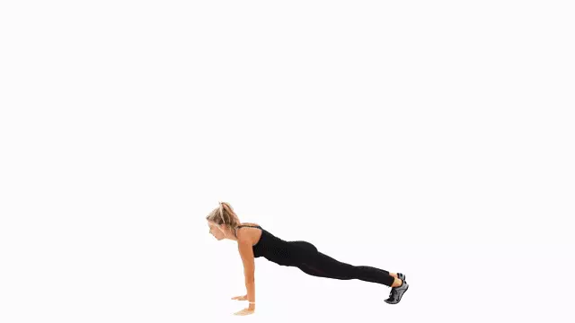
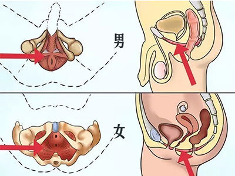

# 久坐办公室人员健康指南

[English](index.md)

## 系统使用暗黑模式
电脑系统在暗黑模式下会将原来大块白色的区域换成灰色，这样能大幅**降低屏幕亮度，减少眼睛疲劳**。
- **Windows 10 +**：打开“设置 - 个性化 - 颜色”设置界面，往下滚动窗口，在“更多选项 - 选择默认应用模式”中选择“暗”。
- **macOS 10.14 +**：打开“系统偏好设置 - 通用”，外观选择“深色”选项。
- **Ubuntu 18.04 +**：安装深色主题`sudo apt install -y gnome-tweaks && gnome-tweaks`，弹出的对话框中，修改“Appearance - Themes - Applications”为“Adwaita-dark”。

## 定时小憩
> _长时间坐着会增加肥胖、高血糖、高血压、心血管疾病和癌症而死亡的风险。 - [梅奥诊所](https://www.mayoclinic.org/healthy-lifestyle/adult-health/expert-answers/sitting/faq-20058005)_

如下是几款定时休息软件，能够定时提醒或强制我们间隔性的小憩。

- [stretchly](https://hovancik.net/stretchly/downloads/) - 跨平台（支持Windows、macOS、Linux系统）的定时锁屏强制休息软件。
- [Big Stretch Reminder](https://monkeymatt.com/bigstretch/) - Windows系统定时锁屏强制休息软件。
- [Time Out](https://apps.apple.com/us/app/time-out-break-reminders/id402592703?mt=12) - macOS系统定时锁屏强制休息软件。

## 使用高分辨率屏幕电脑或显示器
- [笔记本：华为MateBook X Pro]() - 13.9寸, 3000×2000分辨率, Windows、Linux系统
- [笔记本：惠普Spectre x360]() - 15.6寸, 3840×2160分辨率, Windows、Linux系统
- [笔记本：联想Y9000X]() - 15.6寸, 3840×2160分辨率, Windows、Linux系统
- [笔记本：苹果Macbook Pro]() - 16寸, 3072×1920分辨率, macOS系统
- [一体机：微软Surface Studio 2]() - 28寸, 4500×3000分辨率, Windows、Linux系统
- [一体机：苹果iMac Pro]() - 24寸, 5120×2880分辨率, macOS系统
- [一体机：苹果iMac]() - 27寸, 4096×2304分辨率, macOS系统
- [显示器：DELL U2718Q]() - 27寸, 3840×2160分辨率
- [显示器：LG 27UL850]() - 27寸, 3840×2160分辨率
- [显示器：明基EW3270U]() - 31.5寸, 3840×2160分辨率

> 选择显示器前请先确保显卡支持

## 波比跳
波比跳，是burpee音译，是一项结合深蹲、俯卧撑、屈腿收腹等训练的复合动作，训练的肌肉包括核心、手臂、胸肌、背部等，能用到全身75%肌肉。

> 8次为1组，每天做1-8组，即可达到调节心肺功能、减肥、锻炼肌肉功效。关键在于坚持。

## 凯格尔运动
凯格尔运动，又称骨盆运动，于1948年由美国阿诺·凯格尔医生公布，借由重复缩放部分的**骨盆底肌肉**进行，用以帮助怀孕妇人准备生产，降低尿失禁、妇女的产后尿失禁以及男性早泄的问题，也能够增进阳具的勃起硬度等级。

盆骨底肌肉，尿尿一半停住就能感觉到这个肌肉

步骤：
1. 收紧骨盆底肌肉直至不能继续收缩为止。
2. 保持收紧状态5秒，期间保持正常呼吸。
3. 放松盆底肌，5秒后重复下一次。

> 8次为一组，每天1-4组。注意控制好节奏，不要太着急，也不要憋气憋尿。

## 小燕飞
“小燕飞”就是人们模拟燕子飞行姿势进行肢体运动，以达到锻炼腰背肌，缓解腰部、颈肩部等部位的劳损等保健作用的目的。小燕飞适用于：腰肌劳损、腰肌筋膜炎、腰椎间盘突出症、腰椎峡部裂、轻度腰椎滑脱、腰椎术后等。

8次为一组，每天1-8组。注意控制速度，缓慢进行，切勿急上急下，刚开始可先抬头或先抬脚，熟练后再同时抬。

## 站着办公

