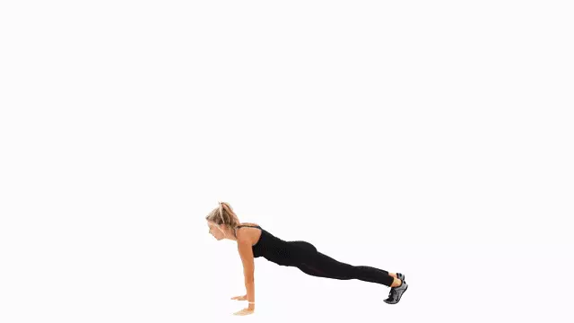
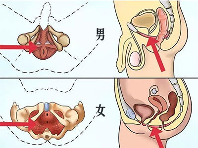

# 办公室人员健康指南

该手册适用于久坐办公室的人。

[English](README.md)

## 使用大屏且高分辨率屏幕

- [华为MateBook X Pro笔记本]() - 13.9寸, `3000 × 2000`分辨率, Windows、Linux系统
- [惠普Spectre x360笔记本]() - 15.6寸, `3840 × 2160`分辨率, Windows、Linux系统
- [联想Y9000X笔记本]() - 15.6寸, `3840 × 2160`分辨率, Windows、Linux系统
- [苹果Macbook Pro笔记本]() - 16寸, `3072 × 1920`分辨率, MacOS系统

- [微软Surface Studio 2一体机]() - 28寸, `4500 × 3000`分辨率, Windows、Linux系统
- [苹果iMac Pro一体机]() - 24寸, `5120×2880`分辨率, MacOS系统
- [苹果iMac一体机]() - 27寸, `4096×2304`分辨率, MacOS系统

- [DELL U2718Q显示器]() - 27寸, `3840×2160`分辨率
- [LG 27UL850显示器]() - 27寸, `3840×2160`分辨率
- [明基EW3270U显示器]() - 31.5寸, `3840×2160`分辨率

> 选择显示器前请先确保显卡支持

## 定时休息
- 软件1
- 软件2

## 电脑使用深色（暗黑）模式
- **Windows 10+**：进入“设置 - 个性化 - 颜色”设置界面，往下滚动窗口，在“更多选项 - 选择默认应用模式”中选择“暗”。
- **macOS 10.14+**：选取苹果菜单 ，“系统偏好设置 - 通用”，外观选择“深色”选项。
- **Ubuntu 18.04+**：安装深色主题`sudo apt install -y gnome-tweaks && gnome-tweaks`，弹出的对话框中，修改“Appearance - Themes - Applications”为“Adwaita-dark”。

## 多看纸质书，少看电子书
比如

## 波比跳运动
波比跳，是burpee音译，是一项结合深蹲、俯卧撑、屈腿收腹等训练的复合动作，训练的肌肉包括核心、手臂、胸肌、背部等，能用到全身75%肌肉。

> 10次为1组，每天做1-8组，即可达到调节心肺功能、减肥、锻炼肌肉功效。关键在于坚持。

## 凯格尔运动
凯格尔运动，又称骨盆运动，于1948年由美国阿诺·凯格尔医生公布，借由重复缩放部分的**骨盆底肌肉**进行，用以帮助怀孕妇人准备生产，降低尿失禁、妇女的产后尿失禁以及男性早泄的问题，也能够增进阳具的勃起硬度等级。

盆骨底肌肉，尿尿一半停住就能感觉到这个肌肉

步骤：
1. 收紧骨盆底肌肉直至不能继续收缩为止。
2. 保持收紧状态5秒，期间保持正常呼吸。
3. 放松盆底肌，5秒后重复下一次。

> 10次为一组，每天1-4组。注意控制好节奏，不要太着急，也不要憋气憋尿。

## 站着办公

