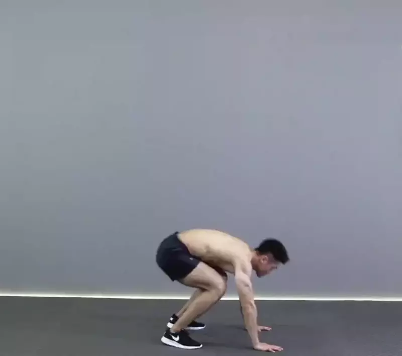
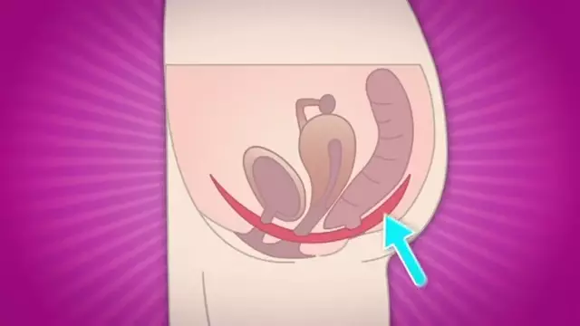

# 抢夺寿命计划

[English](index.md)

随着计算机技术的进步，越来越多的人长期坐在办公室中办公，996、加班、熬夜、通宵成了家常便饭，但是这样的工作方式很快透支我们的身体，大量鲜活的例子就能说明：[《“熬夜多压力大” 李开复患淋巴癌·新京报》](http://www.bjnews.com.cn/finance/2013/09/07/282287.html)，[《36岁猝死IT男考勤纪录曝光：连续5天凌晨打卡·新华网》](http://www.xinhuanet.com/politics/2015-04/14/c_127687302.htm)，[《网易裁员，让保安把身患绝症的我赶出公司。我在网易亲身经历的噩梦！·知乎》](https://zhuanlan.zhihu.com/p/93349725)，所以如何才能健康快乐的工作呢，这就是**抢夺寿命计划**的目的。

目录：
- [暗黑模式](#暗黑模式)
- [定时小憩](#定时小憩)
- [波比跳](#波比跳)
- [小燕飞运动](#小燕飞运动)
- [凯格尔运动](#凯格尔运动)
- [高分辨率屏幕](#高分辨率屏幕)
- [站着办公](#站着办公)

## 暗黑模式
电脑系统在暗黑模式下会将原来大块白色的区域换成灰色，能大幅**降低屏幕亮度，减少眼睛疲劳**。
- **Windows 10 +**：打开“设置 - 个性化 - 颜色”设置界面，往下滚动窗口，在“更多选项 - 选择默认应用模式”中选择“暗”。
- **macOS 10.14 +**：打开“系统偏好设置 - 通用”，外观选择“深色”选项。
- **Ubuntu 18.04 +**：安装深色主题`sudo apt install -y gnome-tweaks && gnome-tweaks`，弹出的对话框中，修改“Appearance - Themes - Applications”为“Adwaita-dark”。

## 定时小憩
> _长时间坐着会增加肥胖、高血糖、高血压、心血管疾病和癌症而死亡的风险。 - [梅奥诊所](https://www.mayoclinic.org/healthy-lifestyle/adult-health/expert-answers/sitting/faq-20058005)_

如下是几款定时休息软件，能够定时提醒或强制我们间隔性的小憩。

- [stretchly](https://hovancik.net/stretchly/downloads/) - 跨平台（支持Windows、macOS、Linux系统）的定时锁屏强制休息软件。
- [Big Stretch Reminder](https://monkeymatt.com/bigstretch/) - Windows系统定时锁屏强制休息软件。
- [Time Out](https://apps.apple.com/us/app/time-out-break-reminders/id402592703?mt=12) - macOS系统定时锁屏强制休息软件。

## 波比跳
波比跳，是burpee音译，是一项结合深蹲、俯卧撑、屈腿收腹等训练的复合动作，训练的肌肉包括核心、手臂、胸肌、背部等，能用到全身75%肌肉。

动作要领：
1. 身体直立，双脚距离与肩同宽，双臂在身体两侧自然下垂。
2. 直腰下蹲，双手撑地，双腿向后跳出成俯卧撑姿势，注意身体保持直线。
3. 撑起的同时，双腿向前跳回起始位置，此时脚掌着地。
4. 然后向上站立并垂直跳跃。

> 8次为1组，每天做1-8组。

> 宁可坚持每天做1组，也不要隔三差五一次做完8组。锻炼，贵在坚持！

- [波比跳](https://www.hiyd.com/dongzuo/165/) - HI运动
- [波比跳动作演示](https://v.qq.com/x/page/d0538ujn7lj.html) - 腾讯视频
- [如何做波比跳burpees，波比跳有几种变式，如何做波比跳让锻炼更有趣，更有挑战性？](https://www.zhihu.com/question/61017592) - 知乎

## 小燕飞运动
**小燕飞**是模拟燕子飞行姿势的一项肢体运动，以达到锻炼腰背肌，缓解腰部、颈肩部等部位的劳损等保健目的。

动作要领：
1. 俯卧垫子或床上，双手向前自然伸开。
2. 挺胸抬头，使头胸离开垫子，同时膝关节伸直，两腿向后离开垫子。期间保持匀速呼吸。
3. 持续5秒，均匀放下。
4. 休息5秒，重复下一次。

> 8次为一组，每天1-8组。

> 注意控制速度，缓慢进行，切勿急上急下，刚开始可先抬头或先抬脚，熟练后再同时抬起。

- [现场演示：保护腰椎间盘的运动——小燕飞](https://v.qq.com/x/page/f0313bfh6uf.html) - CCTV-10《健康之路》
- [“小燕飞”的正确做法是怎样的？](https://v.qq.com/x/page/a0791eulvmw.html) - 贵州卫视《医生开讲》
- [哪些运动可以锻炼腰背部肌肉，进而避免腰痛？]() - 丁香医生回答·知乎

## 凯格尔运动
凯格尔运动，又称骨盆运动，于1948年由美国阿诺·凯格尔医生公布，借由重复缩放部分的**骨盆底肌肉**进行，用以帮助怀孕妇人准备生产，降低尿失禁、妇女的产后尿失禁以及男性早泄的问题，也能够增进阳具的勃起硬度等级。

盆骨底肌肉，也叫做PC肌，尿尿一半停住就能感觉到这个肌肉。

动作要领：
1. 收紧骨盆底肌肉直至不能继续收缩为止。
2. 保持收紧状态5秒，期间保持匀速呼吸。
3. 放松盆底肌，5秒后重复下一次。

> 8次为一组，每天1-8组。

> 注意控制好节奏，慢收慢放，也不要憋气憋尿。

- [女性：凯格尔运动讲解](https://v.qq.com/x/page/z0553llh2z0.html)
- [女性：Yo Yoga 骨盆盆底肌解析](https://v.qq.com/x/page/t0883fqsrt1.html)
- [女性：盆底肌的解剖结构与功能](https://v.qq.com/x/page/e0862qqfhdf.html)
- [女性：知识小课堂之pc肌是什么](https://v.qq.com/x/page/u0876rqzlqz.html)
- [男性：PC肌锻炼法八套动作_PC肌锻炼法视频教程](https://v.youku.com/v_show/id_XMzc4ODgyNDMxMg==.html)
- [男性：擎趣CLUB: 练习PC肌, 男人提升“战斗力”的捷径?](https://v.youku.com/v_show/id_XMjk4MjY0NDA2NA==.html)

## 高分辨率屏幕

使用高分辨率屏幕会消除文字锯齿，内容显示更加清晰，能有效减轻眼睛的识别负担。

- [笔记本：华为MateBook X Pro]() - 13.9寸, 3000×2000分辨率, Windows、Linux系统
- [笔记本：惠普Spectre x360]() - 15.6寸, 3840×2160分辨率, Windows、Linux系统
- [笔记本：联想Y9000X]() - 15.6寸, 3840×2160分辨率, Windows、Linux系统
- [笔记本：苹果Macbook Pro]() - 16寸, 3072×1920分辨率, macOS系统
- [一体机：微软Surface Studio 2]() - 28寸, 4500×3000分辨率, Windows、Linux系统
- [一体机：苹果iMac Pro]() - 24寸, 5120×2880分辨率, macOS系统
- [一体机：苹果iMac]() - 27寸, 4096×2304分辨率, macOS系统
- [显示器：DELL U2718Q]() - 27寸, 3840×2160分辨率
- [显示器：LG 27UL850]() - 27寸, 3840×2160分辨率
- [显示器：明基EW3270U]() - 31.5寸, 3840×2160分辨率

> 选择显示器前请先确保显卡支持

## 站着办公

